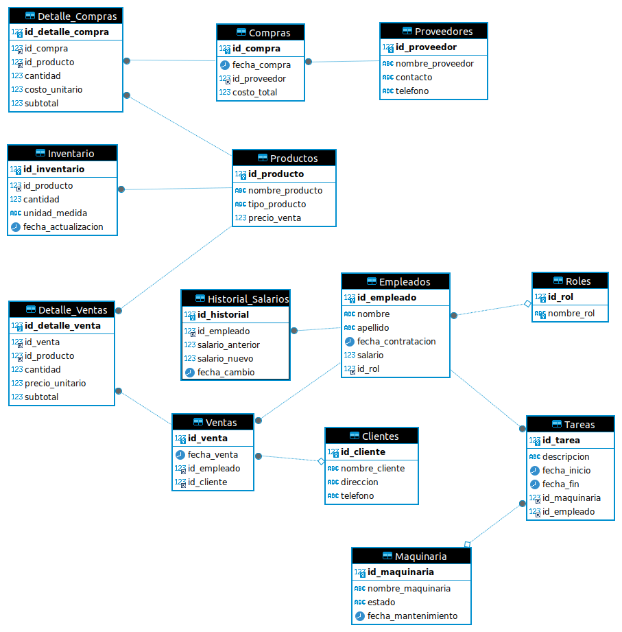

PROYECTO SQL 
README - Sistema de Gestión para Finca Agrícola
Descripción del Proyecto
Este sistema de gestión integral para fincas agrícolas está desarrollado en MySQL y permite administrar todos los aspectos de una operación agrícola moderna. La base de datos está diseñada para manejar producción de cultivos (aguacate, maíz, leche, etc.), control de inventario, ventas y compras, recursos humanos, y mantenimiento de maquinaria. El sistema automatiza procesos clave, optimiza el uso de recursos y genera reportes estratégicos para la toma de decisiones.

Requisitos Técnicos
MySQL Server 8.0+ o MariaDB 10.5+

MySQL Workbench u otro cliente SQL compatible

2GB+ de RAM recomendados para operaciones con grandes volúmenes de datos

500MB+ de espacio en disco para almacenamiento inicial

